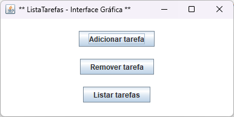
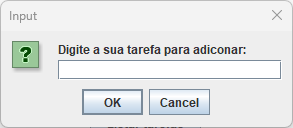
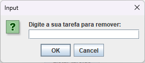
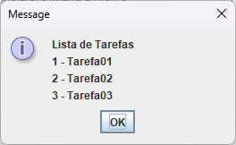

## Lista de Tarefas em Java

Este é um simples programa em Java que cria um lista de tarefas.
O programa permite ao usuário incluir, remover e listar as tarefas.

## Menu
1. [Como Executar](#como-executar)
1. [Funcionalidades do Programa](#funcionalidades-do-programa)
1. [Menu Via Terminal](#menu-via-terminal-lista-tarefas)
1. [Telas](#telas-da-aplicação)

```markdown
## Requisitos

- JDK (Java Development Kit): versão 17
- Git: version 2.40.0.windows.1
- Bibliotecas padrão do Java: Scanner.
```
## Como Executar

1. Clone o repositório:

   ```shell
   git clone https://github.com/rafael-gontijo/lista-tarefas-gui.git
   ```

2. Acesse o diretório do projeto:

   ```shell
   cd .\lista-tarefas-gui\src\application\
   ```

3. Utilize o Java para executar o arquivo:
   ## Via console
   ```shell
   java .\Main.java
   ```
   ou
   ## Via GUI
      ```shell
   java .\ListaTarefasGUI.java
   ```
   
## Funcionalidades do programa:

- **Adicionar tarefa**: O usuário insere uma tarefa a ser adicionada a lista.

- **Remover tarefa**: O usuário insere o número corresponde a tarefa a ser removida da lista.

- **Listar tarefas**: O programa imprime para o usuário as tarefas contidas na lista.


## Menu via terminal Lista Tarefas:

O programa apresenta um menu com as seguintes opções:

Aplicativo de Lista de Tarefas
1. Adicionar tarefa
2. Remover tarefa
3. Listar tarefas
4. Sair
Escolha uma Opção: 

## Telas da aplicação

**Tela Inicial**



**Adicionar Tarefa**



**Remover Tarefas**



**Listar Tarefas**


